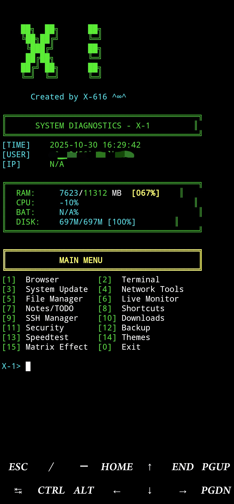

---

# ♥ X-1-Terminal-Menu ♥

**X-1 System Diagnostics:**  
Advanced, color-coded Bash menu for managing Linux/Termux environments.

**Features:**  
- SSH management  
- Security tools  
- Notes & TODO manager  
- Live System Monitor  
- Theming, quick shortcuts, and more!

---



---

## 🚀 Quick Installation (Termux / Linux)

**Follow these steps to install and activate X-1-Terminal-Menu:**

1. **(Optional) Remove the default Termux welcome message:**
   ```bash
   rm $PREFIX/etc/motd
   ```

2. **Install nano editor (if not already installed):**
   ```bash
   pkg install nano
   ```

3. **Open your Bash configuration file:**
   ```bash
   nano ~/.bashrc
   ```

4. **Copy and paste the entire script below into nano.**  
   *(Select all the code block below, copy, and paste it into nano)*

---

```bash
#!/bin/bash

# =========== COLORS ============
RED=$(printf '\033[0;31m')
YELLOW=$(printf '\033[1;33m')
GREEN=$(printf '\033[0;32m')
CYAN=$(printf '\033[0;36m')
BLUE=$(printf '\033[0;34m')
MAGENTA=$(printf '\033[0;35m')
RESET=$(printf '\033[0m')

# =========== CONFIG FILES ============
CONFIG_DIR="$HOME/.x1_config"
NOTES_FILE="$CONFIG_DIR/notes.txt"
SSH_FILE="$CONFIG_DIR/ssh_hosts.txt"
SHORTCUTS_FILE="$CONFIG_DIR/shortcuts.txt"
THEME_FILE="$CONFIG_DIR/theme.conf"
PASSWORD_FILE="$CONFIG_DIR/.passwd"

# Create config directory
mkdir -p "$CONFIG_DIR"

# =========== THEME SYSTEM ============
load_theme() {
  if [[ -f "$THEME_FILE" ]]; then
    source "$THEME_FILE"
  else
    THEME_PRIMARY=$GREEN
    THEME_SECONDARY=$CYAN
    THEME_ACCENT=$YELLOW
    save_theme
  fi
}

save_theme() {
  cat > "$THEME_FILE" << EOF
THEME_PRIMARY='$THEME_PRIMARY'
THEME_SECONDARY='$THEME_SECONDARY'
THEME_ACCENT='$THEME_ACCENT'
EOF
}

# =========== PASSWORD SYSTEM ============
check_password() {
  if [[ -f "$PASSWORD_FILE" ]]; then
    echo -e "${YELLOW}╔════════════════════════════════════════╗${RESET}"
    echo -e "${YELLOW}║          PASSWORD REQUIRED             ║${RESET}"
    echo -e "${YELLOW}╚════════════════════════════════════════╝${RESET}"
    printf "${CYAN}Enter password: ${RESET}"
    read -s pass
    echo ""
    stored_pass=$(cat "$PASSWORD_FILE")
    if [[ "$pass" != "$stored_pass" ]]; then
      echo -e "${RED}Access Denied!${RESET}"
      sleep 2
      exit 1
    fi
    echo -e "${GREEN}Access Granted!${RESET}"
    sleep 1
  fi
}

# =========== LIVE CLOCK ============
show_live_clock() {
  tput cup 0 60
  echo -e "${CYAN}$(date '+%H:%M:%S')${RESET}"
}

# =========== MATRIX EFFECT ============
matrix_effect() {
  clear
  echo -e "${GREEN}"
  for i in {1..30}; do
    echo -n "$(shuf -i 0-1 -n 80 | tr -d '\n')"
    echo ""
    sleep 0.05
  done
  echo -e "${RESET}"
  sleep 0.5
}

# =========== MAIN MENU LOOP ============
main_menu() {
  load_theme

  while true; do
    clear

    # =========== X-1 BANNER ============
    echo -e "${THEME_PRIMARY}"
    echo ""
    echo "    ██╗  ██╗      ██╗"
    echo "    ╚██╗██╔╝      ╚═╝"
    echo "     ╚███╔╝       ██╗"
    echo "     ██╔██╗       ╚═╝"
    echo "    ██╔╝ ██╗      ██╗"
    echo "    ╚═╝  ╚═╝      ╚═╝"
    echo -e "${RESET}"
    echo -e "${THEME_SECONDARY}      Created by X-616 ^∞^${RESET}"
    echo ""

    # =========== SYSTEM INFO ============
    echo -e "${THEME_PRIMARY}╔════════════════════════════════════════╗${RESET}"
    echo -e "${THEME_PRIMARY}║      SYSTEM DIAGNOSTICS - X-1         ║${RESET}"
    echo -e "${THEME_PRIMARY}╚════════════════════════════════════════╝${RESET}"

    # TIME & HOST
    now=$(date "+%Y-%m-%d %H:%M:%S")
    host=$(hostname)
    user=$(whoami)
    ip=$(ip -o -4 addr show wlan0 2>/dev/null | awk '{print $4}' | cut -d/ -f1)
    : "${ip:=N/A}"

    printf "${THEME_SECONDARY}[TIME]${RESET}    ${THEME_PRIMARY}%s${RESET}\n" "$now"
    printf "${THEME_SECONDARY}[USER]${RESET}    ${THEME_PRIMARY}%s@%s${RESET}\n" "$user" "$host"
    printf "${THEME_SECONDARY}[IP]${RESET}      ${THEME_PRIMARY}%s${RESET}\n\n" "$ip"

    # RAM usage
    ram_total=$(free -m 2>/dev/null | awk '/^Mem:/ {print $2}')
    ram_used=$(free -m 2>/dev/null | awk '/^Mem:/ {print $3}')
    ram_perc=$(( ram_used * 100 / ram_total ))

    # CPU usage
    cpu=$(top -bn1 2>/dev/null | grep "Cpu(s)" | awk '{print $2 + $4}' || echo "0")
    cpu_perc=${cpu%.*}

    # Battery
    batt="N/A"
    if command -v termux-battery-status >/dev/null 2>&1; then
      batt=$(termux-battery-status 2>/dev/null | grep percentage | grep -o '[0-9]\+')
    fi

    # Disk
    disk_info=$(df -h / 2>/dev/null | awk 'NR==2 {print $3 "/" $2 " [" $5 "]"}')

    # Display info
    printf "${THEME_PRIMARY}╔════════════════════════════════════════╗${RESET}\n"
    printf "${THEME_PRIMARY}║  RAM:${RESET}     ${THEME_SECONDARY}%04d${RESET}/${THEME_PRIMARY}%04d${RESET} MB  ${THEME_ACCENT}[%03d%%]${RESET}    ${THEME_PRIMARY}║${RESET}\n" "$ram_used" "$ram_total" "$ram_perc"
    printf "${THEME_PRIMARY}║  CPU:${RESET}     ${THEME_SECONDARY}%03d%%${RESET}                        ${THEME_PRIMARY}║${RESET}\n" "$cpu_perc"
    printf "${THEME_PRIMARY}║  BAT:${RESET}     ${THEME_SECONDARY}%s%%${RESET}                         ${THEME_PRIMARY}║${RESET}\n" "$batt"
    printf "${THEME_PRIMARY}║  DISK:${RESET}    ${THEME_SECONDARY}%-22s${RESET}  ${THEME_PRIMARY}║${RESET}\n" "$disk_info"
    printf "${THEME_PRIMARY}╚════════════════════════════════════════╝${RESET}\n\n"

    # =========== MAIN MENU OPTIONS ============
    echo -e "${THEME_ACCENT}╔════════════════════════════════════════╗${RESET}"
    echo -e "${THEME_ACCENT}║           MAIN MENU                    ║${RESET}"
    echo -e "${THEME_ACCENT}╚════════════════════════════════════════╝${RESET}"
    echo -e "${THEME_PRIMARY}[1]${RESET}  Browser        ${THEME_PRIMARY}[2]${RESET}  Terminal"
    echo -e "${THEME_PRIMARY}[3]${RESET}  System Update  ${THEME_PRIMARY}[4]${RESET}  Network Tools"
    echo -e "${THEME_PRIMARY}[5]${RESET}  File Manager   ${THEME_PRIMARY}[6]${RESET}  Live Monitor"
    echo -e "${THEME_PRIMARY}[7]${RESET}  Notes/TODO     ${THEME_PRIMARY}[8]${RESET}  Shortcuts"
    echo -e "${THEME_PRIMARY}[9]${RESET}  SSH Manager    ${THEME_PRIMARY}[10]${RESET} Downloads"
    echo -e "${THEME_PRIMARY}[11]${RESET} Security       ${THEME_PRIMARY}[12]${RESET} Backup"
    echo -e "${THEME_PRIMARY}[13]${RESET} Speedtest      ${THEME_PRIMARY}[14]${RESET} Themes"
    echo -e "${THEME_PRIMARY}[15]${RESET} Matrix Effect  ${THEME_PRIMARY}[0]${RESET}  Exit\n"

    printf "${THEME_SECONDARY}X-1>${RESET} "
    read -r choice

    case $choice in
      1) browser_menu ;;
      2) terminal_mode ;;
      3) system_update ;;
      4) network_tools ;;
      5) file_manager ;;
      6) live_monitor ;;
      7) notes_manager ;;
      8) shortcuts_manager ;;
      9) ssh_manager ;;
      10) download_manager ;;
      11) security_menu ;;
      12) backup_system ;;
      13) speedtest_run ;;
      14) theme_selector ;;
      15) matrix_effect ;;
      0) exit_program ;;
      *) echo -e "${RED}Invalid option!${RESET}"; sleep 1 ;;
    esac
  done
}

# =========== Add your additional functions here (browser_menu, terminal_mode, etc.) ===========

# ============= START ============
check_password
main_menu
```

---

**How to finish setup:**

5. **Save and exit nano:**  
   - Press `Ctrl+O` (then Enter) to save  
   - Press `Ctrl+X` to exit

6. **Close and re-open Termux**  
   - Your new menu will appear at startup!

---

**Enjoy!** 
   ^∞^ 
For questions, improvements, or more features, open an issue or PR on [GitHub](https://github.com/X-616/X-1-Terminal-Menu).

---
